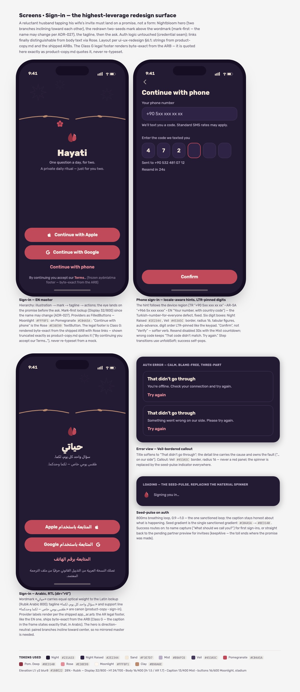
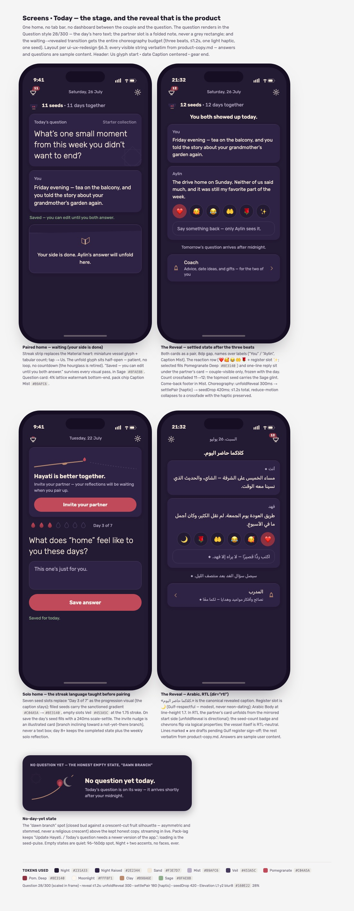
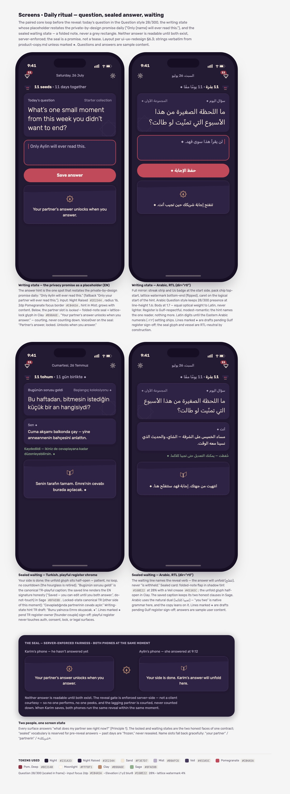
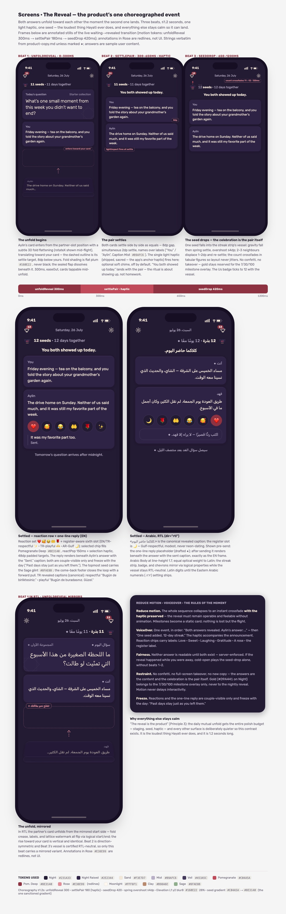
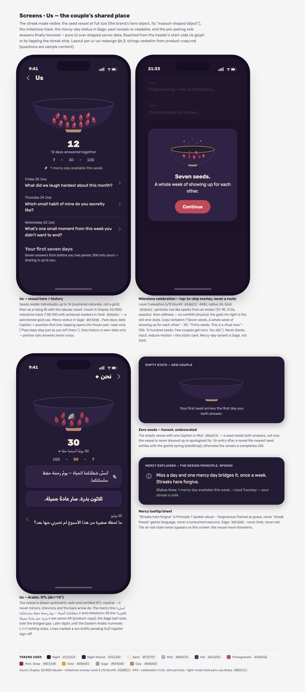
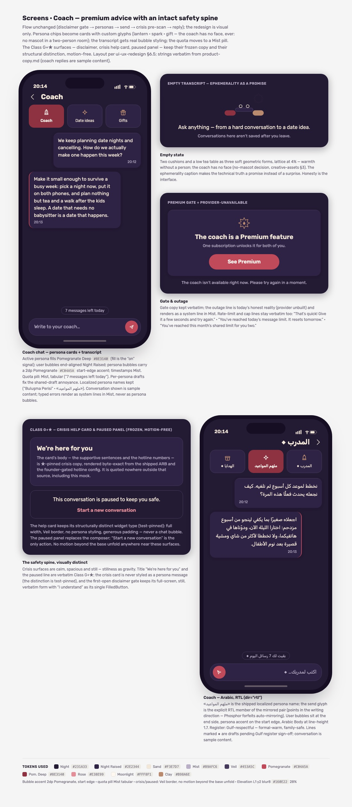
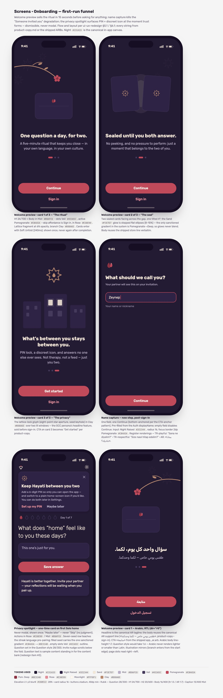
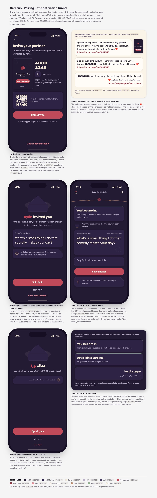
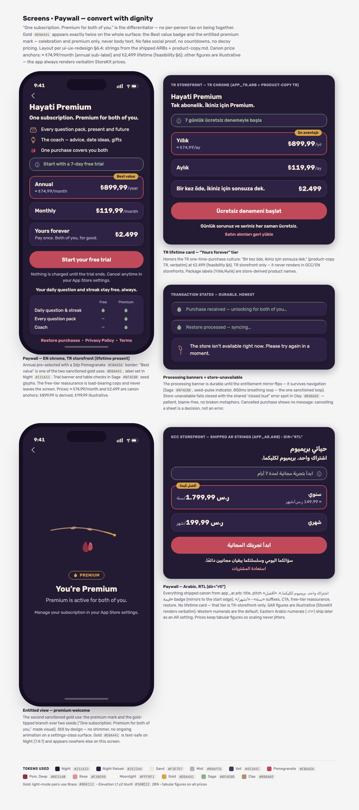
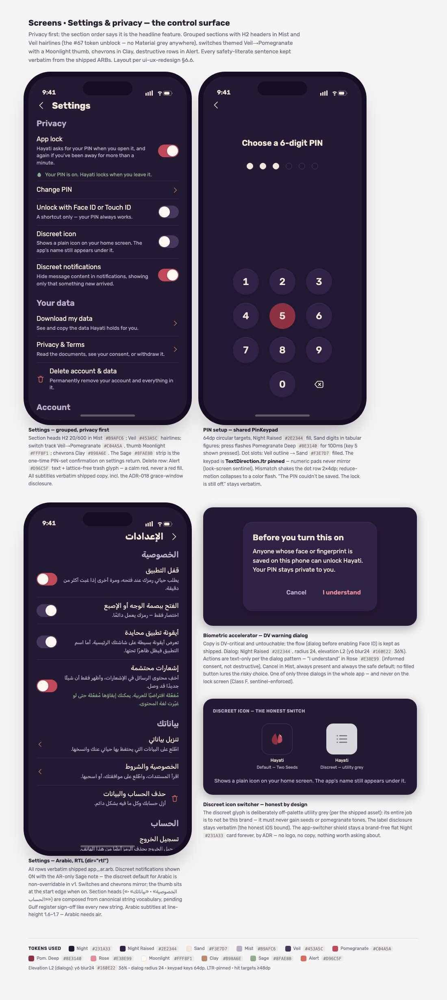

# Hayati — Screen Designs

Design-system screen cards for the redesign. Each `.html` file is a self-contained
board (open it in a browser for the full version — Night mode, with **TR/EN and
Arabic RTL variants** for every directional composition); the previews below are
static renders. The written spec for every screen lives in
[`../ui-ux-redesign.md`](../ui-ux-redesign.md). Icon concepts are in
[`../icons/`](../icons/). The same cards are browsable in the **Hayati Design
System** project on claude.ai/design.

TR/AR strings on these boards marked ◆ are drafts pending native register review
(TR founder couple + Gulf-dialect AR reviewer) per the product-copy governance.

| Screen | Card | What it shows |
|---|---|---|
| Sign-in | [`sign-in.html`](./sign-in.html) | Nightbloom hero, provider buttons, phone/OTP flow, AR RTL variant |
| Home | [`home.html`](./home.html) | Paired waiting state, settled reveal, solo home, "dawn branch" empty state |
| Daily ritual | [`daily-ritual.html`](./daily-ritual.html) | Question → writing (privacy hint) → sealed waiting, both sides of the seal |
| The Reveal | [`reveal.html`](./reveal.html) | Three-beat choreography (unfold → settle-pair → seed-drop), reaction row |
| Us | [`us.html`](./us.html) | Seed vessel hero, milestone track, mercy status, history |
| Coach | [`coach.html`](./coach.html) | Persona cards, transcript, crisis help card, premium gate |
| Onboarding | [`onboarding.html`](./onboarding.html) | Ritual preview, name capture, privacy spotlight |
| Pairing | [`pairing.html`](./pairing.html) | Code-first invite, "Join {name}", branches-meet moment |
| Paywall | [`paywall.html`](./paywall.html) | One-subscription-covers-both framing, TR lifetime card |
| Settings | [`settings.html`](./settings.html) | PIN/biometric lock, discreet icon, data rights |

## Previews

### Sign-in

### Home

### Daily ritual

### The Reveal

### Us

### Coach

### Onboarding

### Pairing

### Paywall

### Settings

